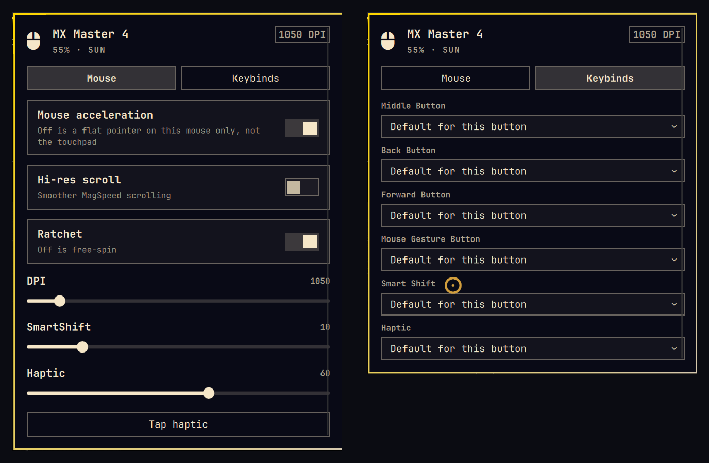
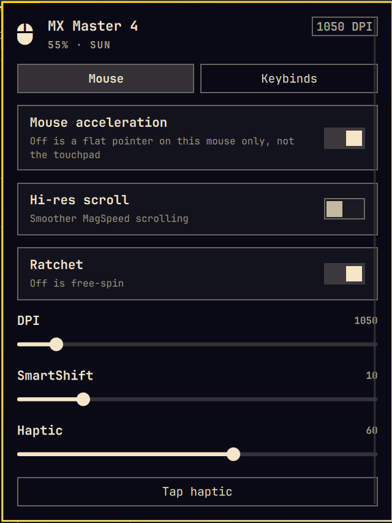
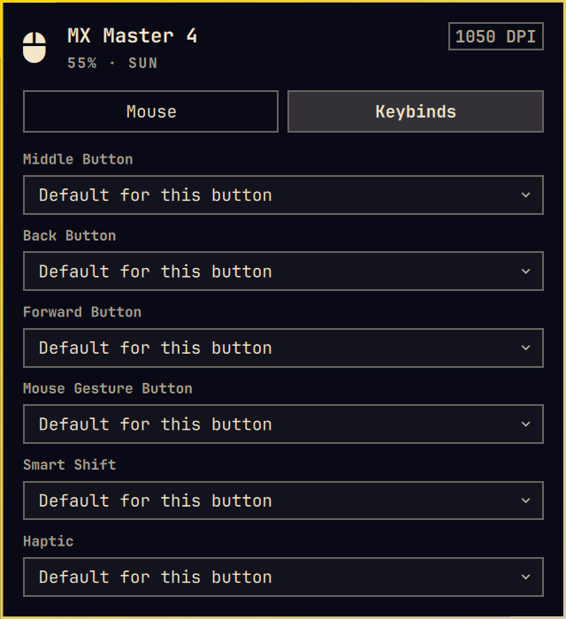

# Omalogimouse

An [Ormus](https://ormus.solutions) plugin for [Omarchy](https://omarchy.org).

Bar widget and panel for Logitech MX Master mice: original, 2S, 3, 3S, and 4
(including for Mac / for Business name variants).

It talks HID++ through Solaar's Python library. The Solaar GUI is not started.
Controls a given model does not expose stay hidden.

No sudo or pkexec is required.

<p align="center">
  
</p>

<p align="center">
  
  
</p>

## Install

```bash
omarchy plugin add https://github.com/Ormus-Solutions/omalogimouse.git --enable
```

The widget lands on the right of the bar. Move it with:

```bash
omarchy bar move omalogimouse --section right
```

## Remove

```bash
omarchy plugin remove omalogimouse
```

That removes the plugin folder. It does not revert Hyprland pointer settings
or delete saved button actions. Those files are safe to delete by hand:

- `~/.local/state/omarchy/omalogimouse-binds.json` — Keybinds tab choices
- marked block in `~/.config/hypr/input.lua` between `-- omalogimouse:begin`
  and `-- omalogimouse:end` — written only if you toggle mouse acceleration

A first-time acceleration change also copies `~/.config/hypr/input.lua` to
`~/.config/hypr/input.lua.bak.omalogimouse`.

## Usage

Left-click the mouse glyph to open the panel.

- **Mouse** tab: acceleration, MagSpeed, ratchet, DPI, SmartShift, haptic
- **Keybinds** tab: extra-button actions (hardware remap or Omarchy/Hyprland)

Middle-click the bar icon to tap haptic on models that have it. Right-click
refreshes. `1` and `2` switch tabs while the panel is focused.

Do not run this next to logiops, OpenLogi, or a live Solaar daemon. Only one
HID++ owner at a time.

## Dependencies

- Omarchy Quattro (`omarchy-shell`, `omarchy` CLI, `hyprctl`)
- `python3`
- `solaar` (provides the `logitech_receiver` library; the Solaar GUI is unused)
- A paired MX Master on a Bolt / Unifying receiver or Bluetooth

## What it executes

All helper commands use a fixed argument list. Nothing is interpolated into a
shell string. Nothing elevates privileges.

- `/usr/bin/python3 -I mx.py` — isolated interpreter, HID++ status/settings/binds
- `/usr/bin/timeout` — 8s on status/actions, 6h on the diverted-key listener
- `/usr/bin/hyprctl` — devices, reload, and configerrors after an acceleration
  toggle; output is time- and byte-capped
- `/usr/bin/omarchy` and `/usr/bin/omarchy-shell` — only for Keybinds actions
  you pick (menu, volume, Exposé, play/pause)
- Optional `~/.local/bin/screenshot-region-clipboard` if it is a user-owned
  regular file (no symlink)

Child processes use a closed environment (`PATH=/usr/bin:/bin`, no `PYTHONPATH`).
Config and binds writes are no-follow, size-capped, and replaced atomically.
A failed Hyprland reload rolls `input.lua` back.

The plugin opens no network sockets and downloads nothing. Acceleration edits
`~/.config/hypr/input.lua` only after you click **Mouse acceleration**. Button
actions are stored only after you pick them on the Keybinds tab.

## License

MIT. See [LICENSE](LICENSE).

Copyright Ormus Solutions — [ormus.solutions](https://ormus.solutions)
